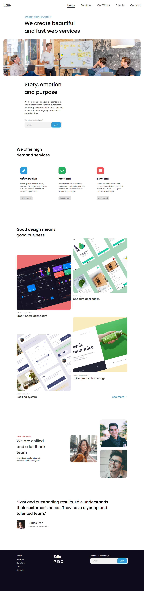

<!-- Please update value in the {}  -->

<h1 align="center">Edie Homepage</h1>

   Solution for a challenge from  <a href="http://devchallenges.io" target="_blank">Devchallenges.io</a>.

  <h3>
    <a href="https://arrizkyhp.github.io/dc-edie-homepage/">
      Demo
    </a>
     | 
    <a href="https://devchallenges.io/solutions/w2X9kR6CnRog7nU6HJdV">
      Solution
    </a>
     | 
    <a href="https://devchallenges.io/challenges/xobQBuf8zWWmiYMIAZe0">
      Challenge
    </a>
  </h3>

<!-- TABLE OF CONTENTS -->

## Table of Contents

- [Overview](#overview)
  - [Built With](#built-with)
- [Features](#features)
- [Contact](#contact)
- [Acknowledgements](#acknowledgements)

<!-- OVERVIEW -->

## Overview

[📱 Mobile Version](./mobile.png)

### Built With

- Html
- Css
- JavaScript

## Features

<!-- List the features of your application or follow the template. Don't share the figma file here :) -->

This application/site was created as a submission to a [DevChallenges](https://devchallenges.io/challenges) challenge. The [challenge](https://devchallenges.io/challenges/xobQBuf8zWWmiYMIAZe0) was to build an application to complete the following user stories:

- [x] User story: I can see a page following the given design.
- [x] User story: I can see a page on mobile following the given design
- [x] User story: I can go to certain locations by selecting links in navigation or footer
- [x] Surprise me with mobile navigation.

## Acknowledgements

<!-- This section should list any articles or add-ons/plugins that helps you to complete the project. This is optional but it will help you in the future. For example -->

- [How TO - Sticky/Affix Navbar](https://www.w3schools.com/howto/howto_js_navbar_sticky.asp)
- [How TO - Change Placeholder Color](https://www.w3schools.com/howto/howto_css_placeholder.asp)
- [Nav-link's to active as you scroll through sections, in 10 Lines of JavaScript;](https://dev.to/areeburrub/change-nav-link-s-style-as-you-scroll-4p62)
- [CodePen Home Smooth Scroll with Offset (no jQuery)](https://codepen.io/ekfuhrmann/pen/pVvpqM)

## Contact

- GitHub [@arrizkyhp](https://github.com/arrizkyhp/})
- Twitter [@arrizkyhp](https://twitter.com/arrizkyhp})
